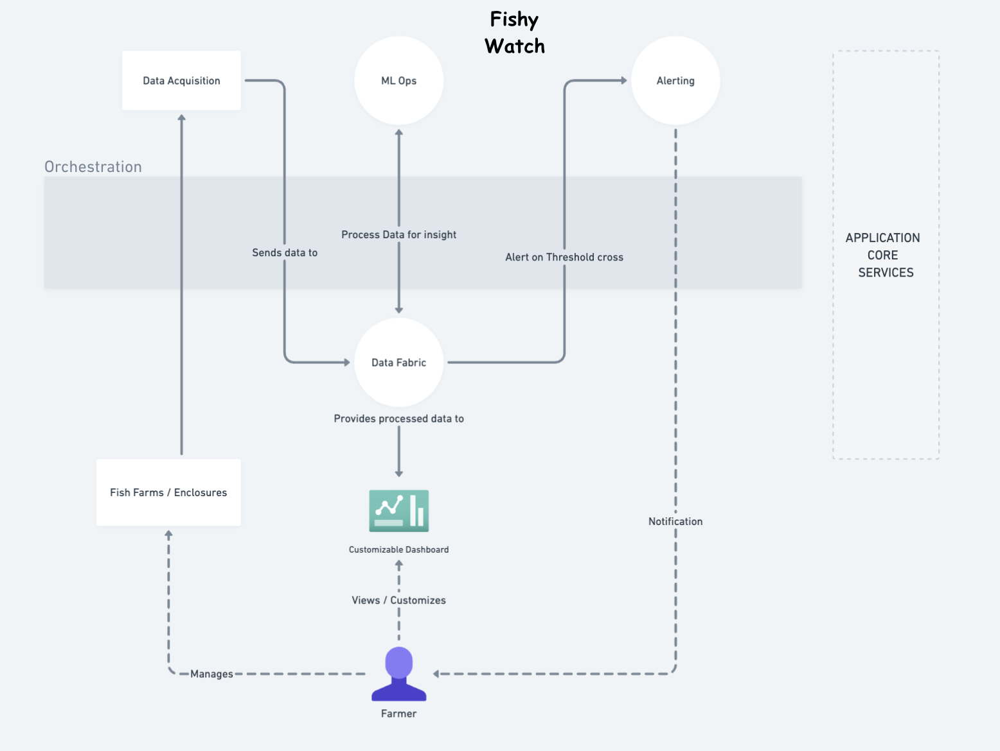

# TeamTechTitans-Katas2024

Team TechTitans Architectural Katas by O'Reilly, April 2024

## Team Members:
- Manas Chaturvedi
- Saransh Jain
- Shishir Kumar
- Greeva Shah
- Sumeet Singh

---

# Fish Watch

[Requirements](Business/Overview.md)

## Business Context
Livestock Insights Incorporated is a company headquartered in Scotland, but
operating globally.

Their main service offering, Fishy Watch, is used by Fish Farmers around the world to monitor their fish, and the fish farms in general
It is able to collect information about individual fish, water quality, and weather information.

Fish farmers use this information to understand the health of their livestock, check for signs of parasites and disease, and work out the best time to harvest.

## High Level Architecture
Below is the proposed high level architecture for implementing the FishWatch solution:

[

## Architecture Characteristics

[

| Architecture Characteristics  | Business Needs |
| ------------- | ------------- |
| Responsiveness | ***Fishy Watch*** must swiftly provide real-time data to farmers, ensuring they can promptly respond to any changes in fish health, water quality, or environmental conditions, thus optimizing farm management practices. |
| Performance | It should efficiently process and analyze large volumes of data collected from multiple farms and devices, ensuring that farmers can access insights without experiencing delays or performance issues. |
| Availability | Ensure uninterrupted access to ***Fishy Watch*** regardless of their location or connectivity constraints. |
| Concurrency  | Support multiple farmers accessing and updating data concurrently without conflicts or inconsistencies, ensuring that each user's actions are accurately reflected in the system in real-time. |
| Data Integrity | Maintain the accuracy, consistency, and reliability of data throughout its lifecycle, implementing measures to prevent data corruption, unauthorized modifications, or loss, thereby ensuring the trustworthiness of the information available to farmers. |
| Security  | Protect sensitive farm data from unauthorized access, breaches, or cyber threats through robust authentication, encryption, and access control mechanisms, safeguarding the confidentiality, integrity, and availability of the data. |
| Scalability | Design the system to seamlessly accommodate the increasing data loads, user demands, and business growth, ensuring that it can scale horizontally or vertically to meet evolving requirements without compromising performance or reliability. |
| Durability | Implement data backup, replication, and disaster recovery mechanisms to ensure the resilience and persistence of data, even in the event of hardware failures, system crashes, or natural disasters, thereby minimizing the risk of data loss and ensuring continuity of operations. |

## Architecture Style Decisions

[
