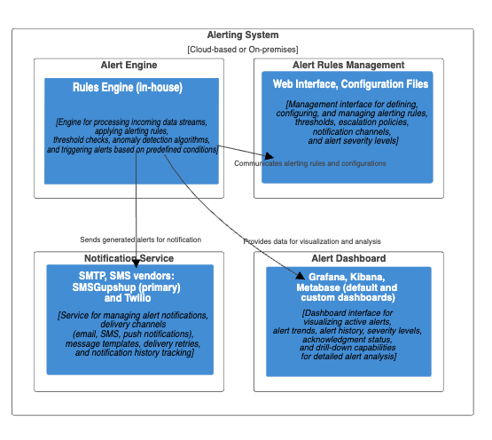

# Alerting System for Fish Watch

***Alerting System*** is the software component responsible for real-time monitoring, anomaly detection, threshold-based alerts, and notification management within the Fish Watch system. It ensures timely alerts and notifications to stakeholders based on predefined conditions and thresholds.

## Component Details

| Component Name  | Component Description | Technology Choices |
| ------------- | ------------- | ------------- |
| ***Alert Engine***  | Engine for processing incoming data streams, applying alerting rules, threshold checks, anomaly detection algorithms, and triggering alerts based on predefined conditions. | Rules Engine (in-house) |
| ***Alert Rules Management***  | Management interface for defining, configuring, and managing alerting rules, thresholds, escalation policies, notification channels, and alert severity levels. | Web Interface, Configuration Files |
| ***Notification Service***  | Service for managing alert notifications, delivery channels (email, SMS, push notifications), message templates, delivery retries, and notification history tracking. | SMTP, SMS vendors: SMSGupshup (primary) and Twilio (fallback), Firebase (push notifications) |
| ***Alert Dashboard***  | Dashboard interface for visualizing active alerts, alert trends, alert history, severity levels, acknowledgment status, and drill-down capabilities for detailed alert analysis. | Grafana, Kibana, Metabase (default and custom dashboards) |

## Architectural Characteristics

| Characteristics  | Decisions |
| ------------- | ------------- |
| Real-time Processing  | Implement real-time processing and streaming analytics for immediate alert generation, alert triaging, and response actions based on live data streams. |
| Scalability  | Design scalable alerting architecture to handle high-volume data streams, concurrent alerts, and distributed alert processing across multiple nodes or clusters. |
| Reliability  | Ensure alerting system reliability with fault-tolerant mechanisms, message persistence, delivery retries, and monitoring for alert system health and performance. |
| Integration  | Integrate alerting system with monitoring tools, data sources, machine learning models, incident management systems, and communication channels for end-to-end alerting workflows. |

## Architectural Choice

- Event-Driven Architecture for real-time event processing, asynchronous alert generation, and event-driven workflows aligned with Fish Watch monitoring needs.

## Deployment View
Below is the deployment view based on the architecture choice and this ADR [Deploy Alerting System in cloud.md](../ADRs/005-alerting-metrics-and-thresholds.md)

