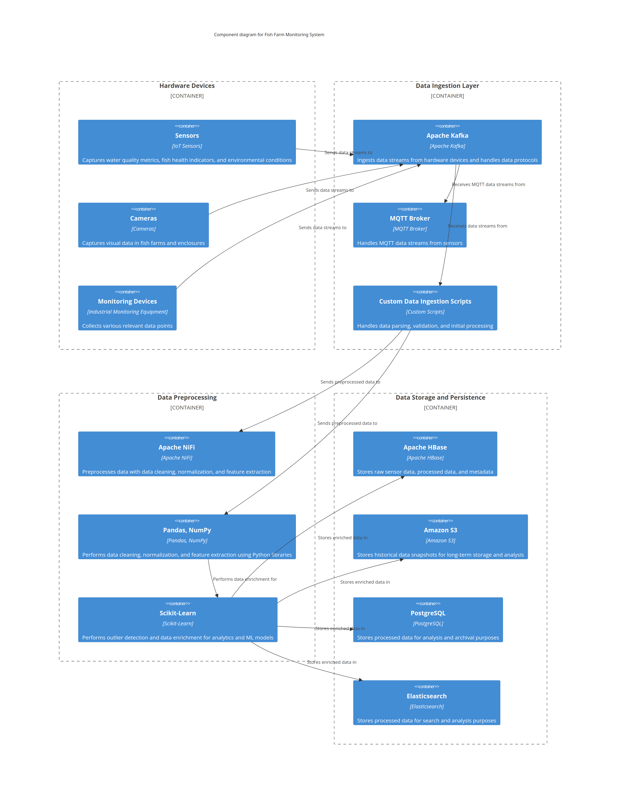

# Data Acquisition for Fish Watch

***Data Acquisition*** is the process of collecting data from hardware devices such as sensors, cameras, and other monitoring equipment within the Fish Watch system. It involves data ingestion, preprocessing, transformation, and storage to enable real-time monitoring and analysis of fish farm conditions.

Below is the high-level architecture view of ***Data Acquisition*** in the Fish Watch system.

## Component Details

| Component Name  | Component Description | Technology Choices |
| ------------- | ------------- | ------------- |
| ***Hardware Devices***  | Sensors, cameras, and monitoring devices installed in fish farms and enclosures to capture water quality metrics, fish health indicators, environmental conditions, and other relevant data points. | IoT Sensors, Cameras, Industrial Monitoring Equipment |
| ***Data Ingestion Layer***  | Layer for ingesting data streams from hardware devices, handling data protocols (MQTT, HTTP, CoAP), data parsing, validation, and initial processing before storage or further processing. | Apache Kafka, MQTT Broker, Custom Data Ingestion Scripts |
| ***Data Preprocessing***  | Preprocessing pipeline for data cleaning, normalization, feature extraction, outlier detection, and data enrichment to prepare raw sensor data for analytics and machine learning models. | Apache NiFi, Pandas, NumPy, Scikit-Learn |
| ***Data Storage and Persistence***  | Storage solutions for storing raw sensor data, processed data, metadata, and historical data snapshots for long-term storage, analysis, and archival purposes. | Apache HBase, Amazon S3, PostgreSQL, Elasticsearch |

## Architectural Characteristics

| Characteristics  | Decisions |
| ------------- | ------------- |
| Real-time Data Processing  | Implement real-time data processing and streaming capabilities for immediate data ingestion, preprocessing, and analysis of live sensor data streams. |
| Scalability  | Design scalable data acquisition architecture to handle high-volume data streams, concurrent device connections, and data storage requirements across multiple farms. |
| Data Quality  | Apply data validation, data integrity checks, duplicate detection, and error handling mechanisms to ensure data accuracy, completeness, and reliability. |
| Connectivity  | Support diverse communication protocols (MQTT, HTTP, CoAP) for data acquisition from hardware devices, considering offline data collection and intermittent connectivity scenarios. |

## Architectural Choice

- Event-Driven Architecture for real-time data ingestion, processing, and storage aligned with Fish Watch data acquisition requirements.

## Deployment View
Below is the deployment view based on the architecture choice and this ADR [Deploy Data Acquisition System in cloud.md](https://github.com/example/adr-repo/blob/main/ADRs/Deploy%20Data%20Acquisition%20System%20in%20cloud.md)

