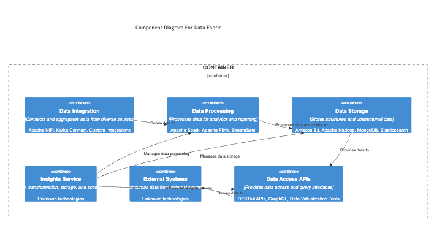

# Data Fabric for Fish Watch System

***Data Fabric*** is the software system responsible for managing data integration, transformation, storage, and access within the Fish Watch system. It ensures data consistency, reliability, and scalability across heterogeneous data sources and analytical workflows.

Below is the high-level architecture view of ***Data Fabric*** in the Fish Watch system.

## Component Details

| Component Name  | Component Description | Technology Choices |
| ------------- | ------------- | ------------- |
| ***Data Integration Layer***  | Integration layer for connecting and aggregating data from diverse sources such as sensors, databases, APIs, and external data providers. | Apache NiFi, Kafka Connect, Custom Integrations |
| ***Data Processing Engine***  | Engine for batch and real-time data processing, transformation, enrichment, and cleansing to prepare data for analytics, machine learning, and reporting. | Apache Spark, Apache Flink, StreamSets |
| ***Data Storage and Management***  | Storage solutions for structured and unstructured data, including data lakes, data warehouses, NoSQL databases, and object storage for scalable, high-performance data storage and retrieval. | Amazon S3, Apache Hadoop, MongoDB, Elasticsearch |
| ***Data Governance and Security***  | Governance framework for data access control, data lineage tracking, data quality monitoring, metadata management, and compliance with data privacy regulations. | Apache Ranger, Apache Atlas, Data Quality Tools, Encryption Tools |
| ***Data Access APIs***  | APIs and services layer for providing data access, query interfaces, data cataloging, and data virtualization capabilities to enable seamless data consumption by applications and users. | RESTful APIs, GraphQL, Data Virtualization Tools |

## Architectural Characteristics

| Characteristics  | Decisions |
| ------------- | ------------- |
| Scalability  | Scalable architecture design to handle large volumes of data, concurrent users, and varied data processing workloads efficiently. |
| Reliability  | Implementation of fault-tolerant mechanisms, data replication, backup strategies, and disaster recovery plans to ensure data availability and durability. |
| Data Quality  | Integration of data quality checks, validation rules, anomaly detection, and data profiling techniques to maintain data accuracy, consistency, and reliability. |
| Performance  | Optimization of data processing pipelines, caching strategies, indexing techniques, and query optimization for fast data access and real-time analytics. |

## Architectural Choice

- Data Mesh Architecture for decentralized data ownership, domain-oriented data domains, and self-serve data capabilities aligned with Fish Watch business domains.

## Deployment View
Below is the deployment view based on the architecture choice and this ADR [Deploy Data Fabric System in cloud.md](https://github.com/example/adr-repo/blob/main/ADRs/Deploy%20Data%20Fabric%20System%20in%20cloud.md)

